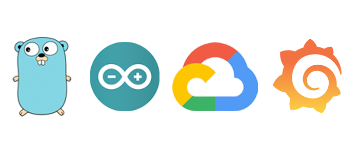
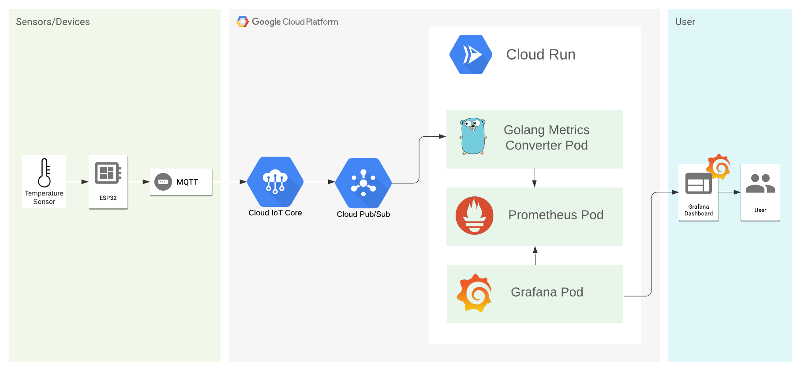

# Monitoring IoT devices data with Golang, Google Cloud Platform and Grafana



This repository is a complement to my medium article. If you wanna follow step by step, check [my writing](https://medium.com/@leonardoaugusto287/monitoring-iot-devices-with-golang-google-cloud-platform-and-grafana-eb99cc36db4b).

## Architecture

This is how our infrastructure works:



## Golang

Running:

```bash
$ go run pubsub.go
```

Running Dockerfile:

```bash
$ docker build . -t metrics-exporter

$ docker run -p 2112:2112 metrics-exporter
```

Deploying to Google Cloud Run:

```bash
$ gcloud builds submit --tag gcr.io/$PROJECT_ID/metrics-exporter

$ gcloud run deploy metrics-exporter --image gcr.io/$PROJECT_ID/metrics-exporter --region $REGION --platform managed --allow-unauthenticated --port 2112
```


## Prometheus

Running Dockerfile:

```bash
$ docker build . -t prometheus

$ docker run -p 9090:9090 prometheus
```

Deploying to Google Cloud Run:

```bash
$ gcloud builds submit --tag gcr.io/$PROJECT_ID/prometheus

$ gcloud run deploy prometheus --image gcr.io/$PROJECT_ID/prometheus --region $REGION --platform managed --allow-unauthenticated --port 9090
```

## Grafana

Running Dockerfile:

```bash
$ docker build . -t grafana

$ docker run -p 3000:3000 grafana
```

Deploying to Google Cloud Run:

```bash
$ gcloud builds submit --tag gcr.io/$PROJECT_ID/grafana

$ gcloud run deploy grafana --image gcr.io/$PROJECT_ID/grafana --region $REGION --platform managed --allow-unauthenticated --port 3000
```

