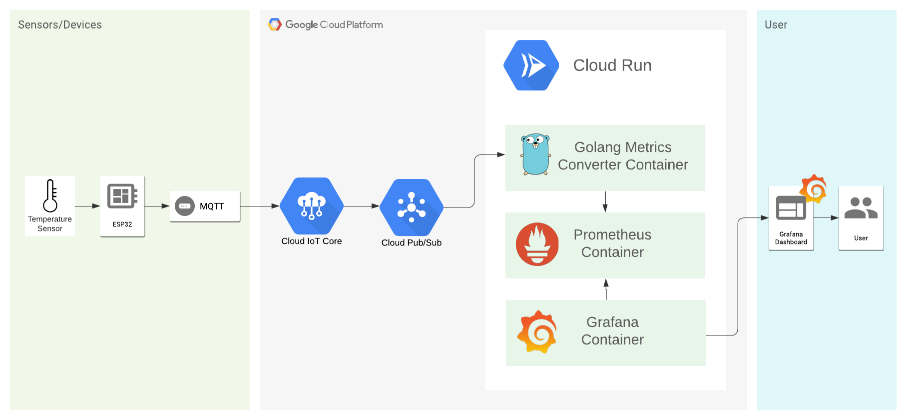

# Monitoring IoT devices data with Golang, Google Cloud Platform and Grafana

This repostiry is a complement to my medium article. If you wanna follow step by step, check [my writing](medium.com).

## Architecture

This is how our infrastructure works:

## Golang

TODO:

## Prometheus

TODO:

## Grafana

TODO:
